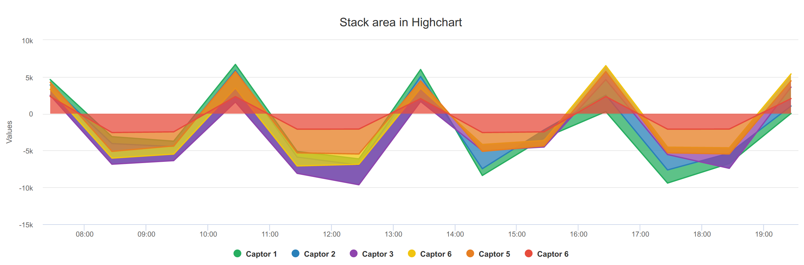
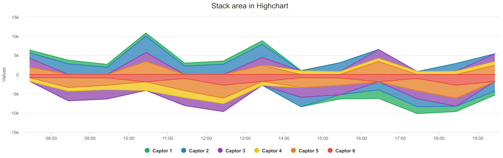
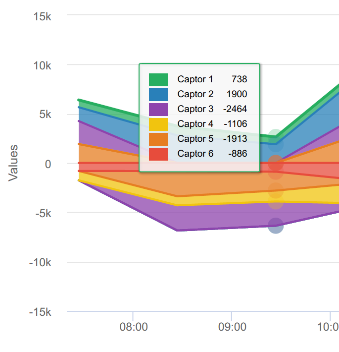
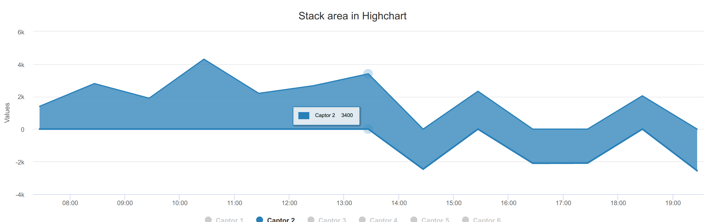
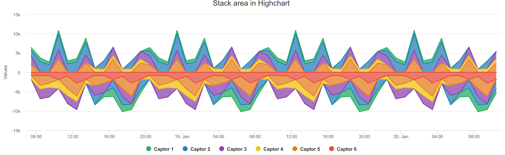
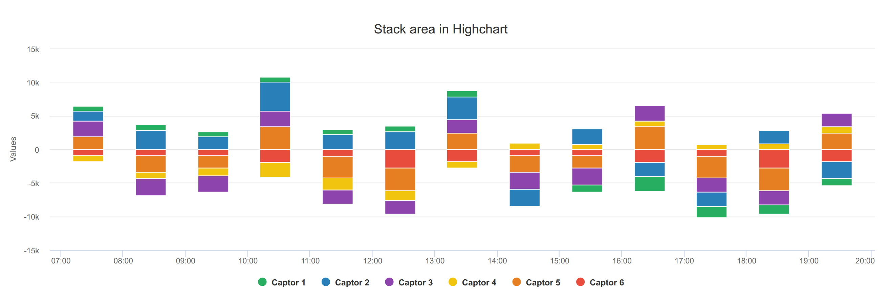

Il existe plusieurs librairies pour faire des graphiques sour votre site web. En ce moment j'utilise https://www.highcharts.com/[highcharts]. Cette librairie a l'avantage de proposer un site avec beaucoup d'exemples et une description fine de l'API.

Mais les options de paramétrages sont très nombreuses et il n'est pas toujours simple de faire un graphique qui colle à notre use case. Je vais prendre un exemple que j'ai rencontré récemment dans lequel je devais créer un graphique composé de zones empilées (staked area) représentant des valeurs négatives et positives. Forcément si j'écris cet article, c'est que tout n'a pas été tout rose et mon cas peut peut être aider d'autres personnes.

== Créer un grapique de type _stacked area_

Prenons un exemple (les sources présentées ici sont disponibles sous https://github.com/javamind/stackedarea[Github]) dans lequel nous essayons d'afficher des mesures temporelles

[source, javascript, subs="none"]
----
{
   source: "Captor 1",
   measures: [
     {
        instant: 1495587600000,
        value: 7390
     },
     {
        instant: 1495591200000,
        value: -5670
     },
     //...
}
----

Si je regarde l'exemple de https://www.highcharts.com/demo/area-stacked je peux écrire

[source, javascript, subs="none"]
----
  function _createSeries() {
    return MEASURES.map((serie) => {
      return {
        type: 'area',
        name: serie.source,
        data: serie.measures.map((measure) => {
          return {x: measure.instant, y: measure.value}
        })
      }
    });
  }

  Highcharts.setOptions({
    title: {text: 'Stack area in Highchart'},
    xAxis: {
      type: 'datetime',
    },
    plotOptions: {
      area: {
        stacking: 'normal',
      }
    }
  });

  new Highcharts.Chart({chart: {renderTo: 'myChart'}, series: _createSeries()})
----

Si les valeurs sont toutes positives ou toutes négatives vous n'avez aucun problème. Par contre si vous avez un mix, https://www.highcharts.com/[Highcharts] n'est pas capable d'afficher correctement les données comme nous pouvons le voir ci dessous.

== Dissocier les valeurs positives et négatives

Pour contourner le problème nous allons n'afficher que des courbes qui contiennent que des valeurs positives ou que des valeurs positives. Pour chaque jeu de données, chaque série du graphe nous allons en créer deux

* une avec des valeurs positives et des 0 à la place des valeurs négatives
* une avec des valeurs négatives et des 0 à la place des valeurs positives

[source, javascript, subs="none"]
----
  function evaluator(measure) {
    if (measure.value > 0) {
      return positive ? measure.value : 0;
    }
    return positive ? 0 : measure.value;
  }

  function _createSeries() {
    return MEASURES.map(serie => [
      _createSerie(serie, color, true),
      _createSerie(serie, color, false)
    ])
    .reduce((acc, val) => acc.concat(val));
  }

  function _createSerie(serie, positive) {
    return {
      type: 'area',
      stack: positive ? 1 : 0,
      showInLegend: positive,
      name: serie.source,
      data: serie.measures.map((measure) => {
        return {x: measure.instant, y: positive !== null ? evaluator(measure) : measure.value}
      })
    }
  }
----

Pour éviter d'avoir une double légende nous utilisons la propriété `_showInLegend: positive_`. Plus important pour avoir un graphique valable, nous devons indiquer à https://www.highcharts.com/[Highcharts] que nous avons 2 manières d'empiler les données (une pour les valeurs positives et une pour les négatives). Nous l'indiquons avec la propriété `_stack: positive ? 1 : 0_`. Les valeurs de cette propriété sont peut importantes elles doivent juste être distinctes dans les 2 cas.

Nous optenons

Est ce mieux ? Les valeurs positives et négatives sont maintenant justes en cumulées. Si je prends le troisième pas de temps

Par contre le dessin du graphe est faux quand nous passons d'une valeur positive à négative. Si nous n'affichons qu'une série nous pouvons voir le problème

Comme nous faisons une référence à 0 le tracé est faux.

== Quelle solution choisir ?

Il n'y a pas de solution idéale. Si vous voulez des zones empilées le tracé de courbe sera faux. Visuellement les défauts sont atténués si vous n'avez pas de grande variation de valeurs et si ces valeurs sont nombreuses.

L'autre solution est de ne pas utiliser ce type de graphique si vous cumulez des valeurs positives et négatives. Vous pouvez par exemple utiliser le type `_column_`

